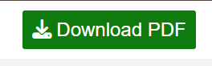
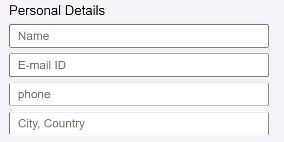
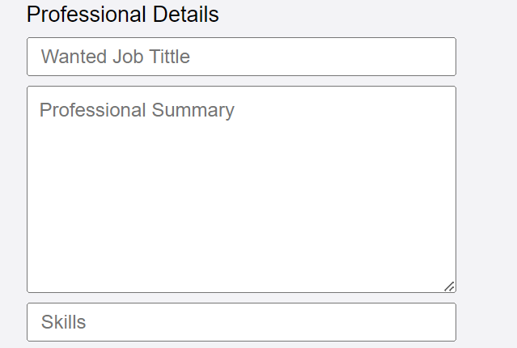
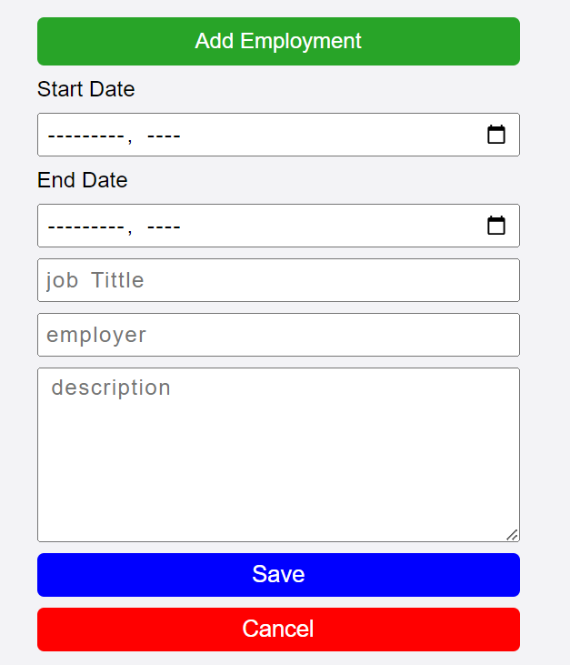
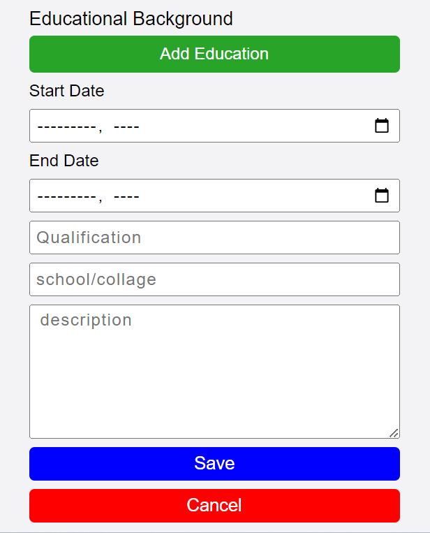
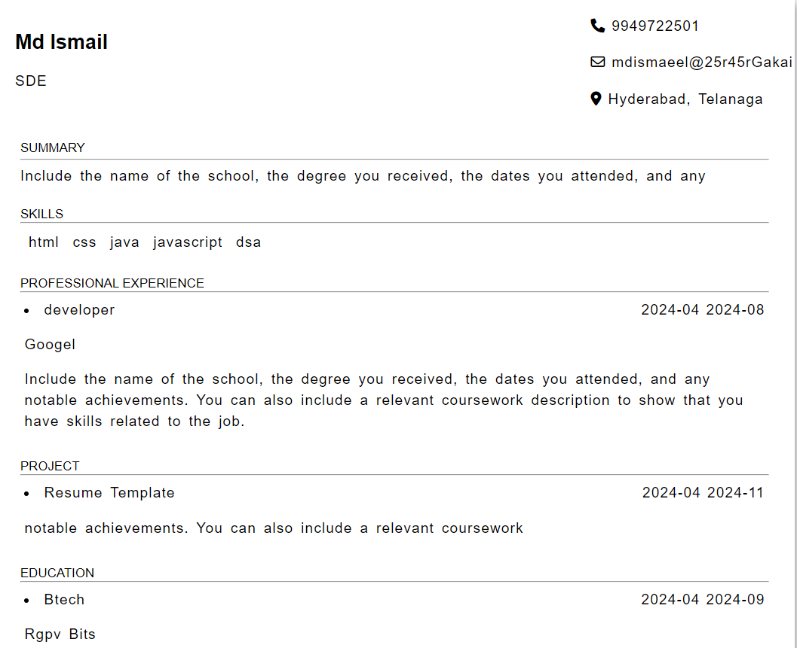
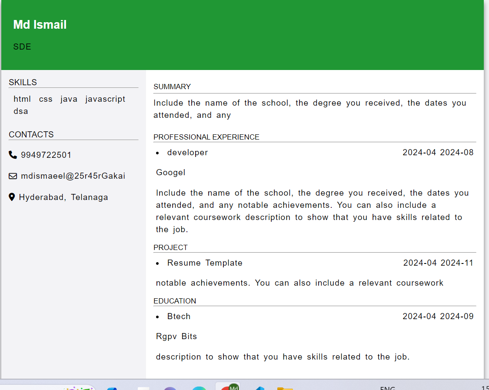
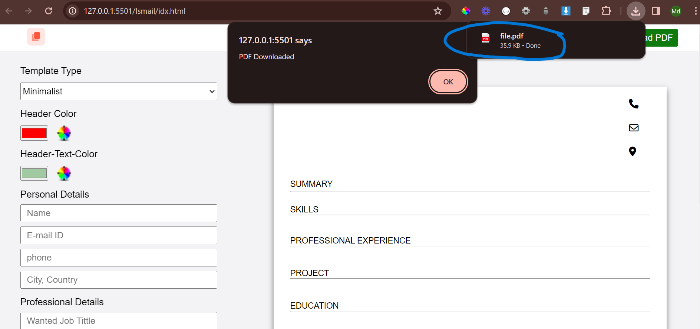

# Resume Template

## Overview

The Resume Builder is a web application that allows users to create and customize their professional resumes with ease. Whether you're a job seeker or just want to maintain an updated resume, this tool simplifies the process and provides a user-friendly interface.

## Tech. Stack Used:

- [HTML](https://en.wikipedia.org/wiki/HTML)
- [Css](https://en.wikipedia.org/wiki/CSS)
- [JavaScript](https://en.wikipedia.org/wiki/JavaScript)
- [JavScript Es6](https://en.wikipedia.org/wiki/JavaScript)
- [GitHub](https://github.com/)
- [Vs-Code](https://code.visualstudio.com/)
- [html2pdh.js](https://rawgit.com/eKoopmans/html2pdf/master/dist/html2pdf.bundle.js)

## Features

1. **Template Selection:** Choose from a variety of professionally designed resume templates to suit your preferences.

2. **Customization:** Easily customize personal details, professional summary, skills, employment history, projects, and education details.

3. **Dynamic Sections:** Add, edit, and remove employment history, projects, and education sections dynamically.

4. **Download as PDF:** Generate and download your resume in PDF format, making it easy to share or print.

5. **Responsive Design:** The application is designed to be responsive, ensuring a seamless experience across various devices.

## Getting Started

Follow these steps to get the Resume Template up and running:

## Usage

### Personal Details:

1. **Edit Personal Information:**
   - Click on the "Personal Details" section in the application.
   - Locate fields for name, contact details, and location.
   - Update each field with your accurate personal information.

### Professional Summary:

1. **Provide a Professional Summary:**
   - Navigate to the "Professional Summary" section.
   - Enter a concise professional summary highlighting your skills and career objectives.
   - Make it engaging and reflective of your professional aspirations.

### Skills:

1. **Add and Manage Your Skills:**
   - Access the "Skills" section of the application.
   - Use the provided interface to add, edit, or remove skills.
   - Ensure your skills accurately represent your strengths and expertise.

### Employment History:

1. **Add Work Experience Details:**
   - In the "Employment History" section, find options to add details.
   - Enter job titles, companies, and dates of your work experience.
   - Provide concise but informative descriptions of your roles.

### Projects:

1. **Include Information About Projects:**
   - Go to the "Projects" section to manage your project details.
   - Add information about projects you've worked on, showcasing your achievements.
   - Highlight your contributions and outcomes.

### Education:

1. **Add Educational Background:**
   - In the "Education" section, input details of your educational background.
   - Include degrees earned, institutions attended, and graduation dates.
   - Provide additional context if needed, such as major or notable achievements.

### Download Resume:

1. **Save Your Resume as PDF:**
   - After completing the sections and ensuring accuracy, find the "Download PDF" button.
   - Click the button to generate and save your resume as a PDF file locally.
   - Access the saved PDF for sharing or printing as needed.

## Screenshots

### copy button

### download button

### when we go to fill the Personal data

### when we go to fill the professional data

### here Adding employment form dynamically when user will click on button

### here Adding Project form dynamically when user will click on button

### here Adding educational form dynamically when user will click on button

### when navigate the template so this is the minimalist Template

;

### when navigate the template so this is the toColumn Template

;

### when pressed on download button template will download

;

## Difficulties Faced

While developing Resume Template, we encountered several challenges, including:

- **User Experience Optimization**: Balancing functionality with user experience was challenging

- **Debugging**: Identifying and resolving bugs.

- **Documentation**: Understanding and following the documentation for resume Template proved to be challenging at times, as it required careful interpretation and implementation.

## Compatibility

### Supported Platforms

The resume template project is compatible with the following platforms:

- Windows
- macOS
- Linux

### Software Dependencies

Ensure the following software dependencies are installed on your Windows system:

- **LaTeX Distribution:** [MiKTeX](https://miktex.org/) for Windows.
- **Text Editor:** [Visual Studio Code](https://code.visualstudio.com/), [Sublime Text](https://www.sublimetext.com/), or [Atom](https://atom.io/)

### Browser Compatibility

Tested on modern web browsers:

- Google Chrome
- Mozilla Firefox
- Microsoft Edge
- Safari

## Hosted Link:-

- [Resume Template](https://jinu-vijayan.github.io/JS_GEEKATHON_TEAM14/Ismail/idx.html)
