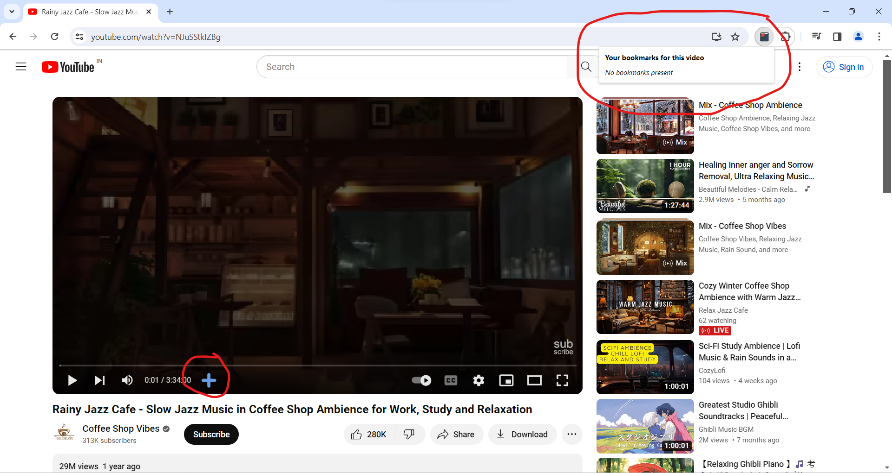

# Chrome extension - Video Marker Plus: Bookmark and Navigate YouTube Videos

"Video Marker Plus is a convenient Chrome extension designed to enhance your YouTube viewing experience. Seamlessly bookmark your favorite moments in any video with a simple click, allowing you to effortlessly revisit them later. With an intuitive interface, our extension lets you assign custom names to your bookmarks or conveniently save them with autogenerated titles. Never lose track of important timestamps again!

Our sleek UI presents each bookmark as a stylish rectangular card, featuring rounded edges for a modern touch. Within each card, easily identify your saved moments by name and access convenient playback and deletion controls. Want to jump back to a memorable scene? Simply hit play, and the video will smoothly navigate to the exact time of your bookmark.

Video Marker Plus is designed with efficiency in mind. It intelligently displays bookmarks that correspond only to the currently playing video, ensuring clutter-free navigation. If no bookmarks exist for your current video, our extension will inform you, keeping your interface clean and focused.

Enhance your YouTube experience today with Video Marker Plus and unlock a whole new level of video navigation and organization."


## Installation

1) **Clone the Repository**: Begin by cloning the GitHub repository containing the extension code. You can do this by running the following command in your terminal or command prompt:

``` bash
git clone https://github.com/Jinu-Vijayan/JS_GEEKATHON_TEAM14.git
```

2) **Navigate to Chrome Extensions**: Open Google Chrome and navigate to the Extensions page. You can do this by clicking on the three-dot menu icon in the top right corner, selecting "More tools," and then choosing "Extensions."

3) **Enable Developer Mode**: In the Extensions page, enable Developer Mode by toggling the switch located in the top right corner of the page.

4) **Load Unpacked Extension**: Once Developer Mode is enabled, you will see additional options appear. Click on the "Load unpacked" button.

5) **Select Extension Directory**: A file dialog will open. Navigate to the directory where you cloned the GitHub repository, and select the `youtube_bookmark_extension` folder.

6) **Confirm Installation**: After selecting the extension directory, Chrome will load the extension, and you should see it listed among your installed extensions.

7) **Verify Extension**: Verify that the extension has been successfully installed by checking for its icon in the Chrome toolbar or extensions menu.

8) **Optional**: Pin Extension: If desired, you can pin the extension to the toolbar for easy access. Right-click on the extension icon and select "Pin."

## Usage

Using Video Marker Plus Chrome extension is straightforward. Once installed, follow these steps to bookmark and navigate through YouTube videos:

1. **Bookmarking Timestamps**:
   - Start watching a YouTube video.
   - When you come across a moment you want to bookmark, click on the **+** button you can see on the youtube videos contorl bar.
   - A modal window will appear, allowing you to provide a custom name for the bookmark. If you don't specify a name, the default name will be used.
   - Click the "Save" button in the modal window to save the bookmark.

2. **Managing Bookmarks**:
   - To access your bookmarks, click on the Video Marker Plus extension icon in the Chrome toolbar.
   - Bookmarks will be displayed as rectangular cards with rounded edges on the interface.
   - Each card shows the bookmark name and provides controls for playback and deletion.
   - To play a bookmarked moment, simply click the "Play" button on the corresponding card. The video will navigate to the bookmarked timestamp and start playing.
   - To delete a bookmark, click the "Delete" button on the corresponding card.

3. **Viewing Bookmarks**:
   - The extension intelligently displays bookmarks that correspond only to the currently playing video.
   - If no bookmarks exist for the current video, the interface will indicate that there are no bookmarks available.

## Features

Video Marker Plus Chrome extension offers the following features:

1. **Bookmarking**: Easily bookmark specific timestamps in YouTube videos with a single click.
   
2. **Customizable Names**: Provide custom names for your bookmarks or use the extension generated default name.

3. **Intuitive UI**: Bookmark cards with rounded edges provide a visually appealing interface for managing bookmarks.

4. **Playback Control**: Play bookmarked moments directly from the bookmark card, seamlessly navigating to the saved timestamp.

5. **Deletion**: Remove unwanted bookmarks effortlessly by clicking the delete button on the bookmark card.

6. **Smart Display**: Bookmarks are intelligently displayed, showing only those that correspond to the currently playing video.

7. **Clutter-Free Experience**: If no bookmarks exist for the current video, the interface remains clean and clutter-free.

8. **Effortless Installation**: Install the extension from the GitHub repository with just a few simple steps.


## Screenshots

### Add bookmark button


### Play bookmark button


### Delete bookmark Button


### When tab is not a youtube video page


### When on youtube page without bookmarks


### When on youtube page with bookmarks


### When add bookmark button is pressed


## New Things Learned

During the development of Video Marker Plus Chrome extension, we learned several new concepts and technologies, including:

- **Chrome Extension Development**: This project provided me with hands-on experience in developing Chrome extensions, allowing me to understand the intricacies of browser extension development.

## Difficulties Faced

While developing Video Marker Plus Chrome extension, we encountered several challenges, including:

- **API Limitations**: Working within the constraints of the Chrome extension API posed challenges, particularly in implementing certain features and interactions.

- **User Experience Optimization**: Balancing functionality with user experience was challenging

- **Debugging**: Identifying and resolving bugs, especially in asynchronous operations and event handling, required extensive debugging and testing.

- **Documentation**: Understanding and following the documentation for Chrome extension development proved to be challenging at times, as it required careful interpretation and implementation.


## Compatibility

Video Marker Plus Chrome extension is compatible with the following:

- **Google Chrome**: The extension is designed to work seamlessly with the Google Chrome web browser.

Please note that the extension may not be compatible with all browser versions, particularly older releases. Ensure that you are using the latest version of your browser for optimal performance.
